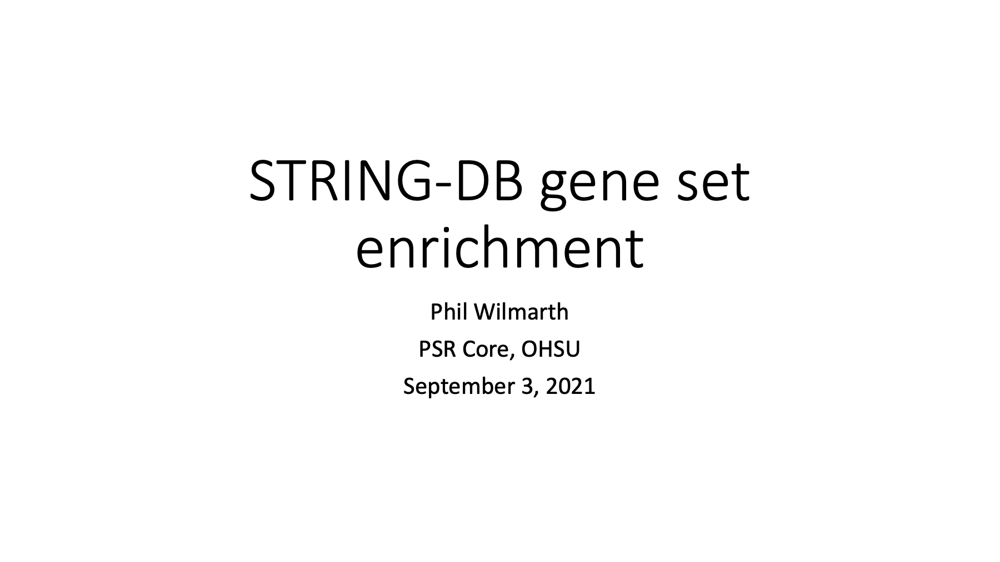
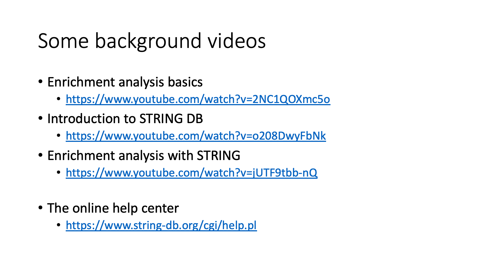
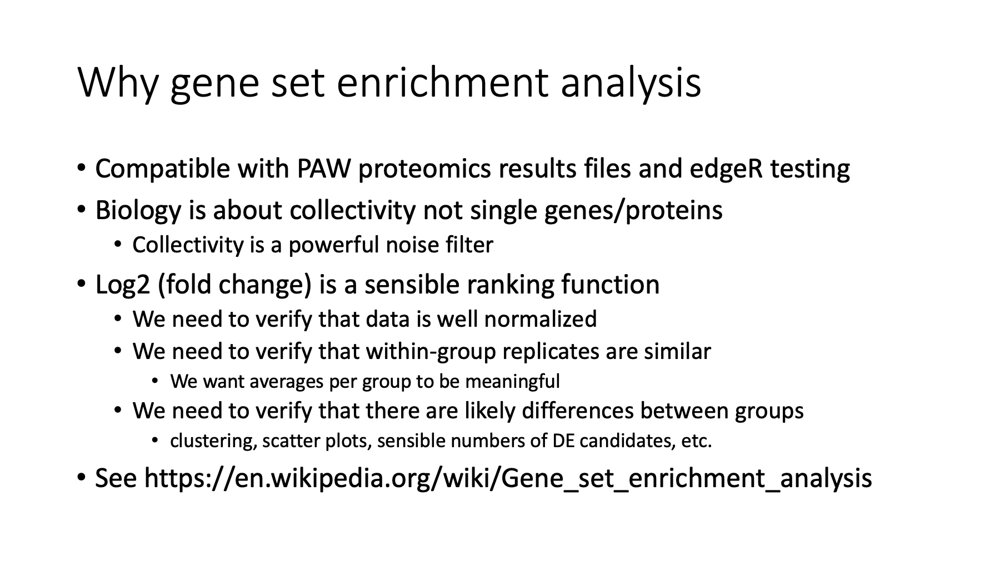
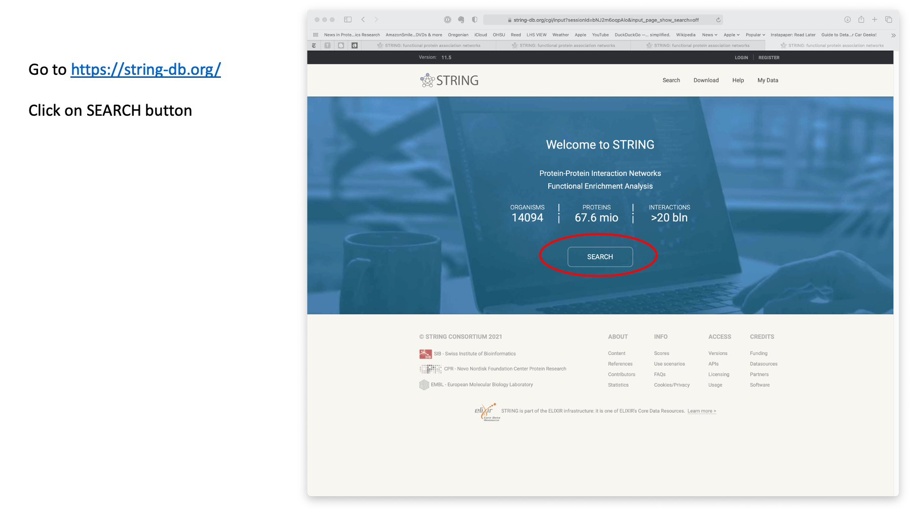
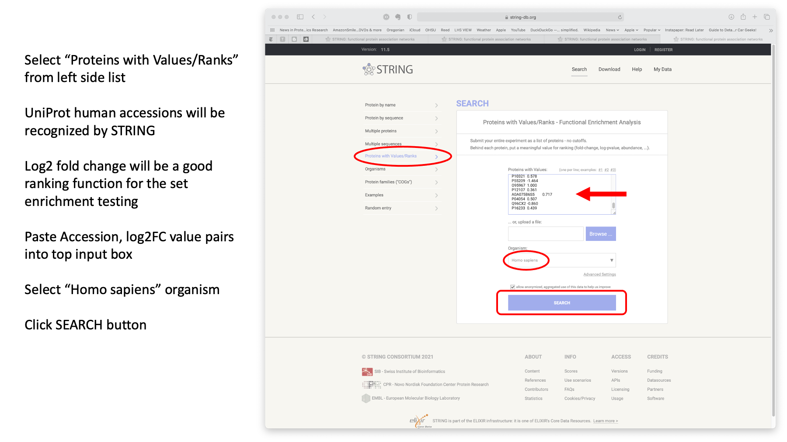
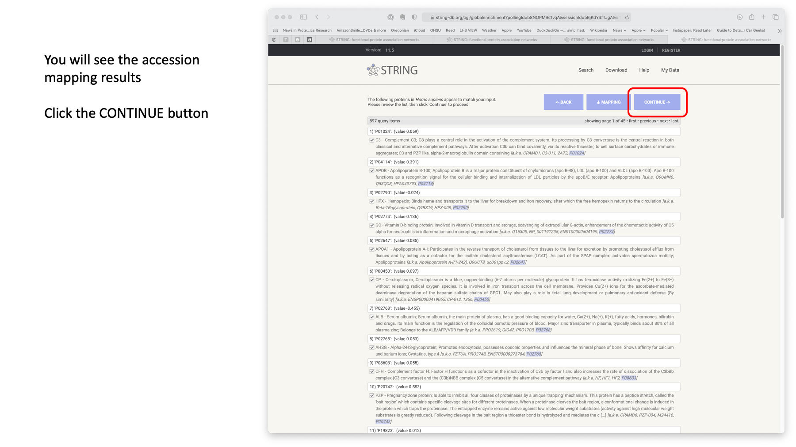
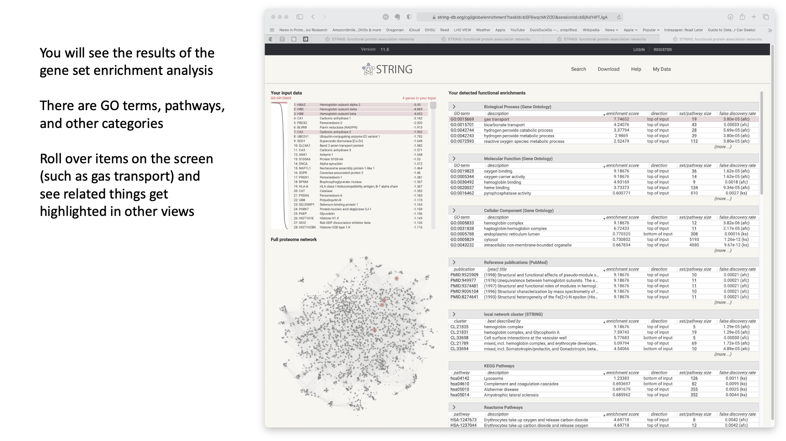
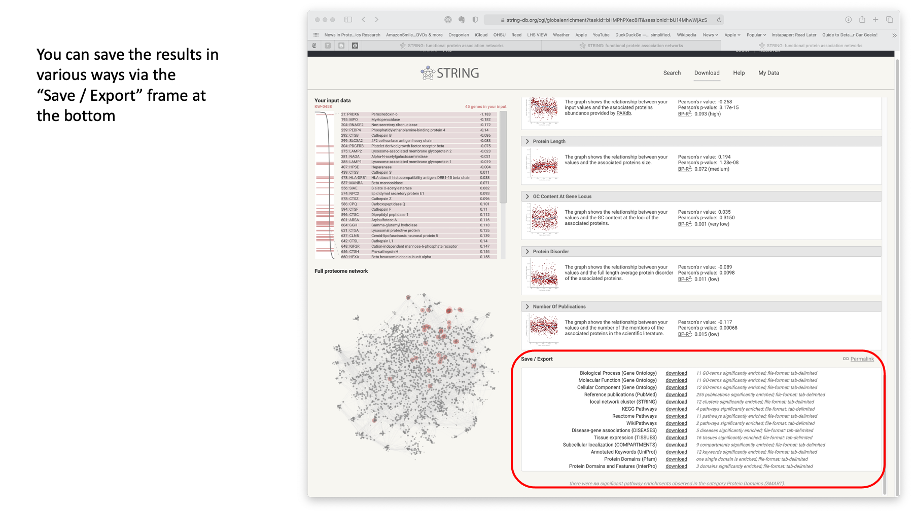

# Gene-set-enrichment_STRING-DB

## Using STRING-DB to do gene set enrichment analyses

### Phil Wilmarth PSR Core, OHSU September 3, 2021

---

**Slide 1**

---

**Slide 2:** Lars Juhl Jensen is one of the three PIs behind STRING-DB. These videos are relatively short and cover concepts more that details.

---

**Slide 3:** You can read more about the concepts behind gene set enrichment at its [Wikipedia page](https://en.wikipedia.org/wiki/Gene_set_enrichment_analysis). Biological processes involve collections (sets) of genes. Trying to paint a biological picture from hundreds to thousands of differentially abundant individual proteins is very challenging. The dimensionality reduction of considering sets of several genes hopefully simplifies the abundance changes and makes seeing the biological picture clearer. [STRING-DB](https://www.string-db.org) can also do gene set enrichment analyses in a very elegant way.

---

**Slide 4:** Go to the STRING-DB [website](https://www.string-db.org). You may get this landing page, or a cached page like on the next slide. `SEARCH` is the portal to the features we want.

---

**Slide 5:** The basic idea with the set enrichment algorithms is that you input a list of identified proteins (your full set of IDs, not just statistically significant differentially abundant proteins) along with a ranking quantity. You can pick lots of things to serve as a ranking function depending on what you want to explore. In quantitative experiments, the log2 fold change value (for pair-wise comparisons) seems like a natural choice. The sign of the log distinguishes proteins whose abundance increased from those whose abundance decreased. The data we need to paste into the input box can be easily extracted from PAW results files and/or edgeR results files. We need the UniProt accession strings and the log2 fold change values.

Keep in mind that we are playing with protein/gene annotation terms. These are really only defined for a handful of model organisms. We can use yeast, mouse, and human accessions without any issues. Other species might require protein mapping to human, mouse, or yeast proteins to get ortholog accessions to use instead of the direct accessions. See [this blog](https://pwilmart.github.io/blog/2019/10/14/orthologs-annotations) for more about orthologs and annotations.

---

**Slide 6:** After you have entered the protein accessions, log2 FC value pairs and clicked `SEARCH`, you will see the results of the accession lookups. If we have used the canonical reference proteomes from UniProt, we should get the majority of the proteins successfully mapped to the internal STRING-DB databases. The FASTA file you pick for the search engine is critical in proteomics data analysis. Clicking on the `CONTINUE` button will start the enrichment analysis.

---

**Slide 7:** After some quick computations, you will get a highly interactive presentation of the results. Enrichment is done in several categories. These are the table blocks on the right. Each table can be expanded. There are two view panels on the left. The top is the protein list ranked from lowest (most negative) log2FC to the highest log2FC (the long skinny plot shows the log2FC values in rank order). The bottom panel shows the highlighted proteins in the protein-protein interaction network view. The right table block lets you click on individual rows and see those proteins highlighted in the left panels. It takes a little time spent clicking on everything you can try and click on to get a sense on the interface. It is quite nice once you get the hang of it.

---

**Slide 8:** You can save all the results tables (the right table blocks) in TSV (tab-separated values) files. They can all be put together as tabs in an Excel workbook to make a nice summary file. A scientist with some experience with the system under study, can probably come to some biological understanding of an experiment after spending a little time exploring the results in this browser window. I am impressed with the clean interfaces and small number of steps to perform these analyses. Doing this without using R or notebooks is important to get the scientists who know the biology over the hurdle to look at the data. This last point is the single biggest challenge in bioinformatics (ha-ha).

---

**Slide 9:** From [Google image search](https://www.google.com/search?q=that%27s+all+folks+looney+tunes&tbm=isch&sxsrf=AOaemvIUQUH-X6uFjP8uUyVMr5hKOsSfpQ%3A1630706005418&source=hp&biw=1269&bih=1134&ei=VZkyYcWxFrKw0PEPqYe72Ac&oq=That%27s+all+folks&gs_lcp=CgNpbWcQARgCMggIABCABBCxAzIICAAQgAQQsQMyBQgAEIAEMgUIABCABDIFCAAQgAQyBQgAEIAEMgUIABCABDIFCAAQgAQyBQgAEIAEMgUIABCABDoICAAQsQMQgwE6CwgAEIAEELEDEIMBOgQIABADUM0LWO41YOVKaABwAHgAgAE-iAHvBpIBAjE2mAEAoAEBqgELZ3dzLXdpei1pbWc&sclient=img#imgrc=mHLnIac4qkRzLM)

---

Phil Wilmarth September 3, 2021
